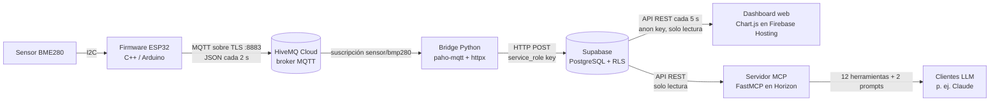

# Estación Meteorológica IoT — ESP32 → MQTT → PostgreSQL → Dashboard + MCP

[🇺🇸 Read in English](READMEEN.md)

Plataforma IoT de datos de extremo a extremo que captura variables atmosféricas (temperatura, presión, altitud y humedad) con un ESP32 + BME280, las transmite por **MQTT/TLS**, las almacena en **PostgreSQL (Supabase)**, las muestra en un **dashboard web en tiempo real** y las expone a **modelos de lenguaje mediante un servidor MCP**.

**Dashboard en vivo:** https://medidor-metereologico.web.app
**Endpoint MCP:** https://estacionmetereologica.fastmcp.app/mcp

Proyecto desarrollado para la asignatura *Advanced Computer Structures* de Broward International University (Prof. Cristian Gabriel Zambrano Vega, PhD).

---

## Arquitectura



**Decisiones de diseño**

- **MQTT en lugar de HTTP directo desde el dispositivo.** Desacopla al emisor (ESP32) de los consumidores, mantiene una conexión persistente de bajo overhead ideal para hardware limitado y permite agregar suscriptores sin modificar el firmware.
- **Acceso a datos con mínimo privilegio.** Row-Level Security permite `SELECT` público pero restringe `INSERT` al `service_role`: solo el bridge escribe; el dashboard y el servidor MCP usan la anon key de solo lectura.
- **Credenciales fuera del código.** Viven en `.env` (Python) y `config.h` (firmware), ambos en `.gitignore`; solo se versionan las plantillas `.example`.

---

## Stack tecnológico

| Capa | Tecnología |
| --- | --- |
| Dispositivo edge | ESP32 + BME280 (I2C), C++ / Arduino (PubSubClient, ArduinoJson) |
| Mensajería | HiveMQ Cloud — MQTT sobre TLS (puerto 8883) |
| Ingesta | Python 3 — paho-mqtt, httpx, python-dotenv |
| Base de datos | Supabase — PostgreSQL con Row-Level Security y API REST automática |
| Frontend | HTML/CSS/JavaScript, Chart.js, Firebase Hosting |
| Integración con IA | Servidor FastMCP desplegado en Horizon |

---

## Funcionalidades

**Firmware (`esp32/estacion.ino`)**
- Lee temperatura, presión, altitud y humedad cada 2 s y publica un JSON en `sensor/bmp280`:
  `{"temperatura":22.5,"presion":752.3,"altitud":2445,"humedad":47.0}`
- Se conecta al broker por TLS y se reconecta automáticamente si pierde WiFi o MQTT.

**Dashboard (`firebase/public/index.html`)**
- Cuatro tarjetas de métricas en vivo, gráfica interactiva para alternar entre variables y promedios por hora.
- Indicador de conexión ("En vivo" o "Sin datos hace X min").

**Servidor MCP (`server.py`)** — permite que cualquier LLM compatible con MCP consulte la estación:

| Herramienta | Función |
| --- | --- |
| `obtener_ultima_lectura` | Lectura más reciente |
| `obtener_ultimas_lecturas` | Últimas N lecturas |
| `obtener_datos_grafico` | Serie cronológica para gráficas |
| `obtener_resumen_estacion` | Promedio, máximo y mínimo |
| `detectar_alertas` | Alertas por reglas (temperatura alta/baja, humedad elevada, presión baja) |
| `obtener_promedio_por_dia` | Promedios diarios |
| `obtener_extremos_por_dia` | Máximos y mínimos diarios |
| `detectar_anomalias` | Valores atípicos (umbral de desviaciones estándar) |
| `obtener_tendencia_reciente` | Tendencia en una ventana reciente |
| `contar_alertas_por_dia` | Conteo de alertas por día |
| `datos_para_dashboard` | Paquete completo para construir dashboards |
| `obtener_info_proyecto` | Información del proyecto y enlaces públicos |

Además, dos prompts que le piden al LLM generar un dashboard HTML o un análisis de tendencias entre dos fechas.

---

## Estructura del repositorio

```
estacion-meteorologica-iot/
├── esp32/
│   ├── estacion.ino          # Firmware del ESP32
│   └── config.h.example      # Plantilla de credenciales WiFi / MQTT
├── bridge/
│   ├── bridge.py             # Solo ingesta MQTT → Supabase
│   ├── bridgeyserver.py      # Ingesta + servidor MCP local (SSE, puerto 8001) en un solo proceso
│   └── .env.example          # Plantilla de variables de entorno
├── firebase/public/
│   └── index.html            # Dashboard web
├── sql/
│   └── schema.sql            # Tabla sensor_data + políticas RLS
├── server.py                 # Servidor MCP de producción (Horizon)
├── requirements.txt
└── Procfile
```

---

## Puesta en marcha

**Requisitos:** cuentas gratuitas en Supabase, HiveMQ Cloud y Firebase; Arduino IDE con el core de ESP32; Python 3.10+.

1. **Base de datos** — crear un proyecto en Supabase y ejecutar `sql/schema.sql` en el SQL Editor.
2. **Broker** — crear un clúster Serverless en HiveMQ Cloud y credenciales MQTT (host + puerto 8883).
3. **Firmware** — instalar *Adafruit BME280*, *Adafruit Unified Sensor*, *PubSubClient* y *ArduinoJson*; copiar `esp32/config.h.example` como `config.h`, completar credenciales y cargar `estacion.ino`. Conexión: `3.3V→VCC`, `GND→GND`, `GPIO21→SDA`, `GPIO22→SCL`.
4. **Bridge** —
   ```bash
   cp bridge/.env.example bridge/.env   # completar valores de Supabase y HiveMQ
   pip install -r requirements.txt
   python bridge/bridgeyserver.py       # ingesta + MCP en http://localhost:8001/sse
   ```
5. **Dashboard** —
   ```bash
   npm install -g firebase-tools
   firebase login && firebase init hosting   # directorio público: public, sin SPA
   cp firebase/public/index.html public/index.html
   firebase deploy
   ```
6. **MCP en producción** — conectar el repositorio a Horizon, configurar las mismas variables de entorno y desplegar `server.py`.
7. **Conectar un LLM** — en Claude.ai ir a *Configuración → Conectores → Agregar conector personalizado* y pegar la URL MCP. Luego preguntar, por ejemplo: *"¿Cuál es la temperatura actual?"* o *"¿Hay alguna alerta meteorológica?"*

---

## Seguridad

| Mecanismo | Qué protege |
| --- | --- |
| TLS en el puerto 8883 | Cifra el tráfico dispositivo-broker |
| `.env` / `config.h` + `.gitignore` | Mantiene las credenciales fuera del repositorio |
| Row-Level Security | Lectura pública, escritura solo para `service_role` |
| Llaves anon / service separadas | Solo el bridge puede insertar datos |

---

## Próximos pasos

- Validar el certificado TLS del broker en el ESP32 (hoy usa `setInsecure()` en modo desarrollo).
- Agregar pruebas unitarias a las herramientas MCP y un pipeline de CI (lint + pruebas en cada push).
- Contenerizar el bridge con Docker.
- Reconstruir el dashboard como SPA en React + TypeScript.

---

## Autor

**Marco Antonio Muñoz Ramírez** — Ingeniero Electrónico, candidato a M.S. en Computer Software Engineering (IA), Broward International University
[GitHub](https://github.com/marcomuoz56-dev)
